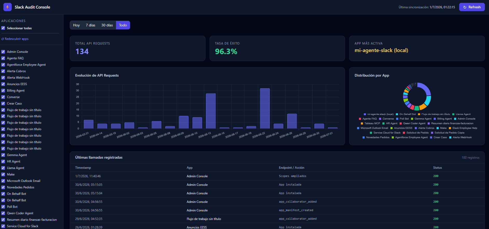

# ⚡ Slack Audit Console

A local web application to monitor and visualize audit log events from Slack apps in **Enterprise** workspaces, using a Pull model.



---

## 🧰 Tech Stack

| Layer | Technology |
|---|---|
| Backend | Python 3.11+, FastAPI, Uvicorn |
| HTTP Client | httpx (async) |
| Database | SQLite (local file) |
| Config | `.env` (local, never committed) |
| Frontend | HTML5, Tailwind CSS (CDN), Vanilla JS ES6 |
| Charts | Chart.js 4.4 |

---

## ⚙️ Requirements

- Python 3.11+
- A Slack **User Token** (`xoxp-...`) from an **Org Admin** account in an Enterprise Grid organization

**Required OAuth scopes:**

| Scope | Purpose |
|---|---|
| `auditlogs:read` | Read audit log events |
| `admin.apps:read` | List installed apps |

---

## 🔑 How to Get Your Slack Token

You need a **User OAuth Token** (`xoxp-`) with admin permissions. Follow these steps:

**1.** Go to [api.slack.com/apps](https://api.slack.com/apps) and click **Create New App** → **From scratch**

**2.** Give it a name (e.g. `Audit Console`) and select your Enterprise Grid workspace

**3.** In the left menu go to **OAuth & Permissions**

**4.** Scroll to **User Token Scopes** (not Bot Token Scopes) and add:
   - `auditlogs:read`
   - `admin.apps:read`

**5.** Scroll up and click **Install to Workspace** (or **Reinstall** if already installed)

**6.** After the OAuth flow completes, copy the **User OAuth Token** — it starts with `xoxp-`

**7.** Paste it into the app's setup screen on first run

> ⚠️ The token is stored only in your local `.env` file and never leaves your machine.

---

## 🚀 Getting Started

**1. Clone the repository**

```bash
git clone https://github.com/pacemaximiliano/slack-audit-console.git
cd slack-audit-console
```

**2. Install dependencies**

```bash
pip install -r requirements.txt
```

**3. Start the server**

```bash
uvicorn main:app --reload --host 127.0.0.1 --port 8000
```

On Windows you can also double-click `start.bat` — it installs dependencies and starts the server automatically.

**4. Open the app**

Go to `http://127.0.0.1:8000` in your browser.

On first run you will see a setup screen — paste your `xoxp-` token and click **Guardar y continuar**.

**5. Discover your apps**

Click **↺ Redescubrir apps** in the left sidebar to fetch all installed apps from your Slack org.

**6. Import audit data**

Click the **Refresh** button in the top bar to pull audit events from Slack and populate the dashboard.

**7. Explore**

Use the sidebar checkboxes to filter by app and the period buttons (Today / 7d / 30d / All) to change the time range.

---

## 📋 How It Works

1. **Token setup** — Enter your `xoxp-` token once. It is stored locally in a `.env` file and never leaves your machine.
2. **Discover apps** — Click "Redescubrir apps" to fetch all installed apps from your Slack org via `admin.apps.approved.list` and audit log scanning.
3. **Refresh** — Click the "Refresh" button to pull audit events from Slack's `audit/v1/logs` API and store them in the local SQLite database.
4. **Explore** — Filter by time period (Today / 7d / 30d / All) and by app using the sidebar checkboxes. Charts and metrics update instantly.

---

## 📁 Project Structure

```
├── main.py              # FastAPI server and API routes
├── database.py          # SQLite setup and CRUD operations
├── slack_client.py      # Slack API integration (httpx async)
├── requirements.txt     # Python dependencies
├── start.bat            # Windows startup script
├── .env                 # Created on first run — contains your token (gitignored)
├── database.db          # Local SQLite database (gitignored)
├── audit.log            # Application log with rotation (gitignored)
└── templates/
    └── index.html       # Full SPA frontend
```

---

## 📊 What Data Is Shown

This app reads from the **Slack Audit Logs API**, which records administrative security events — not individual API call traffic. Each row in the dashboard represents one auditable activity:

| Event | Meaning |
|---|---|
| App instalada | An app was installed in the workspace |
| Scopes ampliados | An app requested additional permissions |
| Token de bot usado | An app token was used to authenticate |
| App aprobada | An admin approved the app |
| App restringida | An admin restricted the app |
| Token rotado | An app token was regenerated |

---

## ⚠️ Disclaimer

This project is provided **as-is**, for educational and internal tooling purposes.

- This is **open source** software, free to use, modify, and distribute.
- **The author assumes no responsibility** for any use, misuse, data loss, security issues, or consequences arising from downloading, running, or deploying this application.
- It is the **sole responsibility of the person running this application** to ensure they have proper authorization to access their organization's Slack audit logs and comply with their organization's security policies.
- **Never commit your `.env` file or Slack tokens** to any public repository.
- This tool makes API calls to Slack on your behalf using credentials you provide. Review the source code before running it.

---

## 📄 License

MIT License — see [LICENSE](LICENSE) for details.
